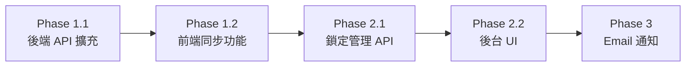

# 員工旅遊費用申請系統 - 開發計畫

根據 `需求說明書.md` 與現有程式碼分析，整理出以下開發計畫。

---

## 1. 現狀分析

### 1.1 已完成功能 ✅

| 模組 | 功能 | 狀態 |
| :--- | :--- | :---: |
| **前端 (app.js)** | 費用記錄 (CRUD)、多幣別自動換算 | ✅ |
| | 照片拍攝與 IndexedDB 離線儲存 | ✅ |
| | 員工名單管理 | ✅ |
| | Excel 申請單匯出 (送簽用) | ✅ |
| | 團長匯入團員費用、合併 Excel | ✅ |
| | PWA 離線支援 (Service Worker) | ✅ |
| | 雲端上傳 (`submitToCloud`) | ✅ |
| | 審核狀態查詢 (`checkTripStatus`) | ✅ |
| **後端 (Code.gs)** | `submitTrip` 新增/更新申請 | ✅ |
| | `getTripStatus` 查詢狀態 | ✅ |
| | 照片上傳至 Google Drive | ✅ |
| | 管理員登入與權限驗證 | ✅ |
| | 逐筆費用審核與狀態推導 | ✅ |
| **管理後台 (admin/)** | 申請列表、詳情檢視 | ✅ |
| | 審核操作 (通過/退回/補件) | ✅ |

### 1.2 待開發功能 🚧

根據 PRD 需求，以下功能尚未實作：

| 優先級 | 功能項目 | 對應 PRD 章節 |
| :---: | :--- | :--- |
| **P0** | TripCode 分享機制（團長產生、團員加入） | 3.1.1 |
| **P0** | 同名檢核 (Duplicate Check) | 3.1.3 |
| **P0** | 版本/時間戳記檢核 (Timestamp Check) | 3.1.3 |
| **P1** | 雲端下載/同步功能（跨裝置） | 3.1.3 |
| **P1** | 結案鎖定/解鎖機制 | 3.3.2 |
| **P2** | 審核預通知信 (Email) | 3.2.2 |
| **P2** | 鎖定狀態上傳阻擋 | 3.1.3 |

---

## 2. 開發階段規劃

### Phase 1：核心同步機制 (預估 2-3 週)

#### 1.1 後端 API 擴充 (`Code.gs`)

| 新增項目 | 說明 |
| :--- | :--- |
| `isLocked` 欄位 | 在 Trips 表新增鎖定狀態欄位 |
| `serverLastModified` 欄位 | 記錄每次更新的伺服器時間戳 |
| 同名檢核 API | 上傳前檢查同 TripCode 下是否有同名提交者 |
| 版本衝突檢查 | 比對 `localLastModified` vs `serverLastModified` |
| 鎖定檢查 | 上傳時檢查 `isLocked` 狀態 |
| `downloadTrip` API | 新增下載/同步 API，回傳完整費用與照片資料 |

#### 1.2 前端同步功能 (`app.js`)

| 新增項目 | 說明 |
| :--- | :--- |
| `localLastModified` 追蹤 | 每次本地修改時更新時間戳 |
| 同名警示彈窗 | 上傳時若發現同名資料，提供覆蓋或改名選項 |
| 版本衝突提示 | 若雲端較新，提示先下載同步 |
| 下載同步按鈕 | 輸入 TripCode + 姓名，從雲端拉取資料 |
| 鎖定警示 | 若 Trip 已鎖定，顯示錯誤並建議聯絡團長 |

---

### Phase 2：團長整併與鎖定 (預估 1-2 週)

#### 2.1 後端管理 API (`Code.gs`)

| 新增項目 | 說明 |
| :--- | :--- |
| `adminLockTrip` | 團長/管理者鎖定特定 TripCode |
| `adminUnlockTrip` | 解鎖 TripCode |
| `adminGetAllMembers` | 取得該 TripCode 下所有成員資料（供整併） |

#### 2.2 管理後台 (`admin/`)

| 新增項目 | 說明 |
| :--- | :--- |
| 鎖定/解鎖按鈕 | 在 Trip 詳情頁加入鎖定控制 |
| 鎖定狀態顯示 | 列表與詳情頁顯示 🔒/🔓 狀態 |

---

### Phase 3：通知機制 (預估 1 週)

#### 3.1 Email 預通知 (`Code.gs`)

| 新增項目 | 說明 |
| :--- | :--- |
| `sendReviewNotification` | 審核狀態變更時發送 Email 給管理員 |
| Email 範本 | 包含 TripCode、申請人、補件項目與備註 |
| 管理員 Email 設定 | 在指令碼屬性新增 `ADMIN_EMAIL` |

---

## 3. 技術實作細節

### 3.1 資料結構變更

#### Trips 表新增欄位

```diff
現有：tripCode, location, startDate, endDate, subsidyAmount, 
      paymentMethod, subsidyMethod, submittedBy, submittedDate, 
      status, reviewNote, reviewDate

+ isLocked (BOOLEAN)        — 是否結案鎖定
+ serverLastModified (TEXT) — 伺服器最後更新時間 ISO 格式
```

#### 前端 LocalStorage 結構

```diff
appData: {
  tripCode: string,
  tripInfo: {...},
  expenses: [...],
  employees: [...],
+ localLastModified: string  // ISO timestamp
}
```

---

### 3.2 API 規格設計

#### `checkDuplicate` - 同名檢核

```javascript
// Request
{ action: 'checkDuplicate', tripCode: 'TRP-XXX', submittedBy: '王小明' }

// Response (有同名)
{ success: true, hasDuplicate: true, lastUpdated: '2026-01-30T10:00:00Z' }

// Response (無同名)
{ success: true, hasDuplicate: false }
```

#### `downloadTrip` - 下載同步

```javascript
// Request
{ action: 'downloadTrip', tripCode: 'TRP-XXX', submittedBy: '王小明' }

// Response
{
  success: true,
  tripInfo: {...},
  expenses: [...],
  employees: [...],
  photos: { 'exp-id-1': 'base64...', ... },
  serverLastModified: '2026-01-30T10:00:00Z'
}
```

#### `lockTrip` / `unlockTrip` - 鎖定管理

```javascript
// Request
{ action: 'adminLockTrip', token: 'xxx', tripCode: 'TRP-XXX' }

// Response
{ success: true, isLocked: true }
```

---

## 4. 驗證計畫

### 4.1 手動測試清單

由於目前專案沒有自動化測試，建議以下手動測試流程：

#### 同步機制測試

1. **同名檢核**
   - 使用 A 裝置上傳資料（姓名：王小明）
   - 使用 B 裝置以相同 TripCode + 姓名上傳
   - 預期：彈出「發現同名資料」提示

2. **版本衝突**
   - A 裝置上傳 → B 裝置下載 → A 裝置修改再上傳
   - B 裝置（未同步）嘗試上傳
   - 預期：提示「雲端已有較新版本，請先下載同步」

3. **鎖定阻擋**
   - 管理後台鎖定 TripCode
   - 前端嘗試上傳
   - 預期：提示「案件已鎖定，請聯絡團長解鎖」

#### 管理後台測試

4. **鎖定/解鎖操作**
   - 在後台點擊鎖定按鈕 → 驗證狀態變更
   - 點擊解鎖 → 驗證可再次上傳

### 4.2 部署後驗證

1. 部署 GAS 至 Web App
2. 更新前端的 GAS URL
3. 執行上述手動測試流程
4. 確認 Google Sheets 資料正確寫入

---

## 5. 開發順序建議



| 階段 | 預估時間 | 交付物 |
| :--- | :--- | :--- |
| Phase 1.1 | 3-5 天 | 更新後的 `Code.gs` |
| Phase 1.2 | 3-5 天 | 更新後的 `app.js`、`index.html` |
| Phase 2.1 | 2-3 天 | 鎖定/解鎖 API |
| Phase 2.2 | 2-3 天 | 更新後的 `admin.js`、`admin/index.html` |
| Phase 3 | 2-3 天 | Email 通知功能 |

---

## 6. 風險與注意事項

> [!WARNING]
> **Google Apps Script 限制**
> - API 執行時間限制：6 分鐘
> - Email 發送限制：每日 100 封（免費帳戶）
> - 需確保照片 base64 大小不超過單次請求限制

> [!IMPORTANT]
> **資料遷移**
> - 現有 Trips 表需新增 `isLocked` 與 `serverLastModified` 欄位
> - 建議先執行遷移腳本，為既有資料補上預設值

---

## 7. 後續擴展建議

- [ ] 增加使用者身份驗證（Google OAuth）
- [ ] 支援多團長協作管理
- [ ] 費用分攤計算功能
- [ ] 行動端推播通知

---

> **文件版本**：1.0  
> **建立日期**：2026-01-30  
> **對應需求**：[需求說明書.md](file:///Users/dreamgen/StudioProjects/travel-expense-app/需求說明書.md)
