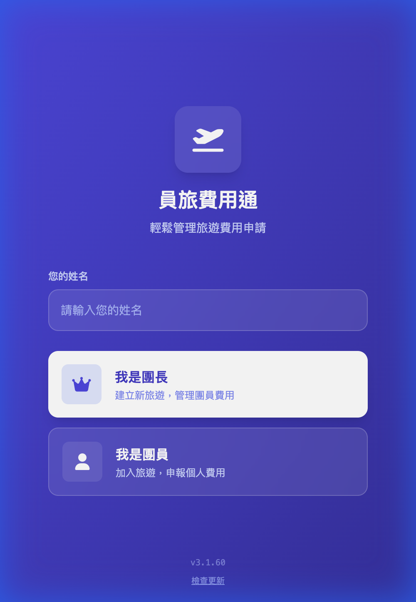
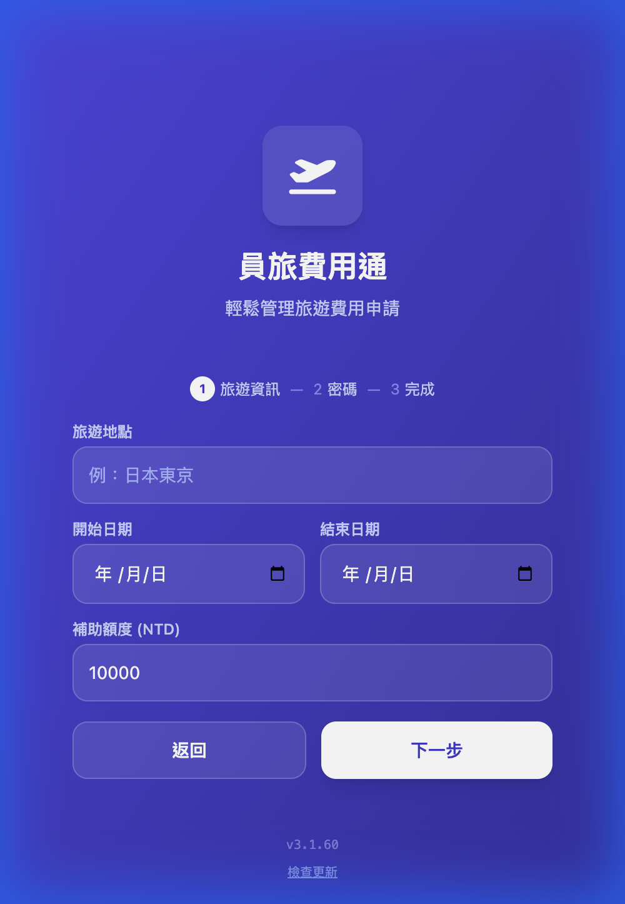
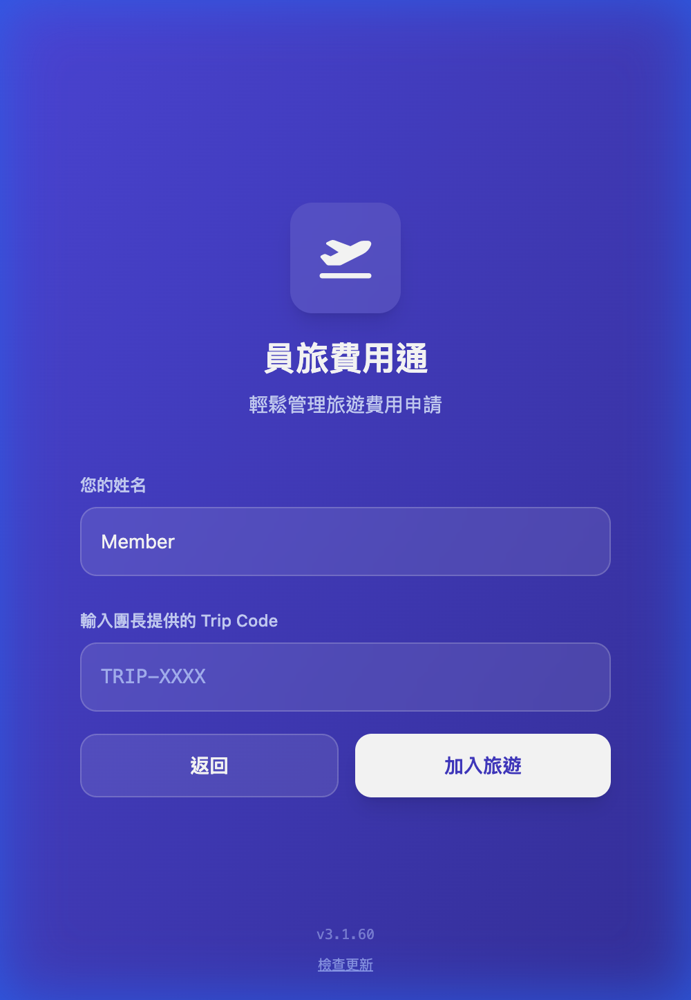
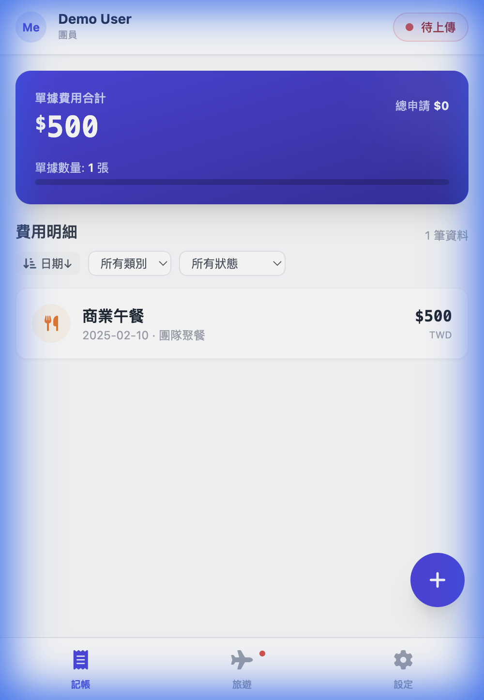
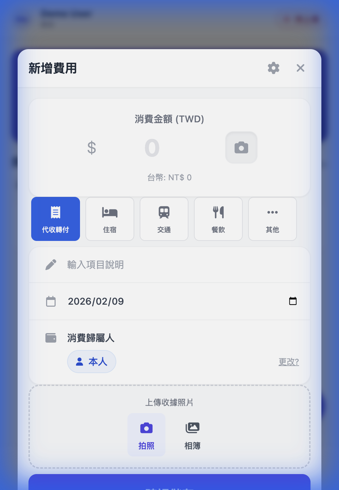
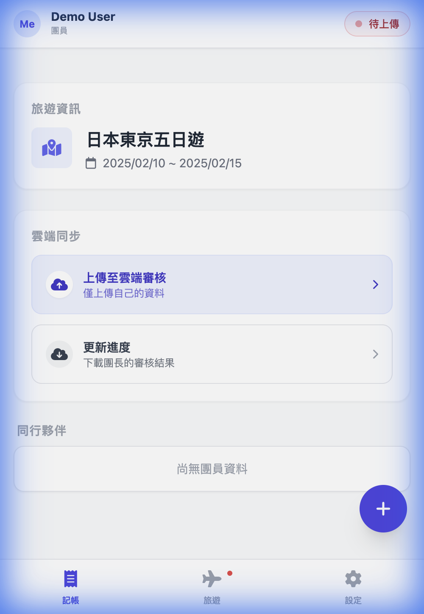

# 員旅費用通 - 操作手冊

歡迎使用「員旅費用通」！這是一款專為團體旅遊設計的費用管理工具，支援離線記帳與單據拍照。

## 📱 第一步：安裝應用程式 (建議)

本系統為 PWA (漸進式網頁應用程式)，建議將其加入手機主畫面以獲得最佳體驗（全螢幕、離線使用）。

*   **iOS (iPhone)**: 使用 Safari 開啟網頁 -> 點擊下方「分享」圖示 -> 選擇「加入主畫面」。
*   **Android**: 使用 Chrome 開啟網頁 -> 點擊右上角選單 -> 選擇「安裝應用程式」或「加入主畫面」。

  

---

## 👑 團長操作指南

### 1. 建立旅遊 (Create Trip)
1.  開啟 App，點擊「**我是團長**」。
2.  **設定旅遊資訊**：輸入地點、日期、每人補助額度。
3.  **設定團長密碼**：請設定一組密碼，用於日後登入後台管理（請妥善保管）。
4.  **綁定員工**：在下拉選單中選擇您自己的名字，以便系統統計您的個人費用。
5.  完成後，系統會生成 **Trip Code** (例如 `TRIP-20250210-ABCD`)。

  

### 2. 邀請團員
1.  在「旅遊」分頁的上方資訊卡，您可以找到 **Trip Code**。
2.  點擊「**複製代碼**」或「**邀請連結**」，發送給所有團員。

### 3. 管理團員與進度
1.  切換至「**旅遊**」分頁。
2.  下方「**團員管理**」區塊會顯示已加入的團員名單。
3.  點擊「**前往團務管理**」按鈕，輸入密碼登入後台：
    *   **查看明細**：檢視所有人的記帳與單據照片。
    *   **匯出申請單**：點擊「**產生 Excel 申請單**」，產出標準報帳表格。
    *   **團務狀態**：可切換旅遊狀態（進行中/送出審核/結案）。
    *   **鎖定管理**：旅遊結束後，請開啟「**已鎖定**」，防止團員誤改資料。

### 4. 雲端備份 (重要)
團長的手機資料為「主份 (Master)」。
*   請定期在「旅遊」分頁點擊「**上傳備份**」。
*   這會將最新的旅遊設定與您的個人記帳同步至雲端。

---

## 👤 團員操作指南

### 1. 加入旅遊
1.  開啟 App，點擊「**我是團員**」。
2.  輸入團長提供的 **Trip Code**。
3.  **選擇身分**：在選單中點選您的名字。
    *   *注意：若找不到名字，請聯繫團長更新員工名單。*
4.  點擊「**加入旅遊**」。

  

### 2. 開始記帳
1.  切換至「**記帳**」分頁。
2.  點擊右下角「**＋**」按鈕新增費用。
3.  輸入類別、金額、說明。
4.  **拍照**：點擊相機圖示，直接拍攝收據或選擇照片（無網路也可拍攝）。
5.  點擊「**新增**」儲存。

  
  

### 3. 雲端同步
**有網路時，請務必進行同步！**
1.  切換至「**旅遊**」分頁。
2.  點擊「**上傳我的費用**」：將您的記帳資料備份至雲端。
3.  點擊「**更新進度**」：下載團長的最新設定或審核結果。
    *   若有費用被「退回」或需要「補件」，更新後會在記帳列表中看到提示。

  

### 4. 查看同行夥伴
在「旅遊」分頁下方，您可以查看到目前已加入的同行夥伴名單。

---

## ❓ 常見問題 (FAQ)

**Q1: 在飛機上沒有網路可以用嗎？**
A: **可以！** 您可以正常記帳、拍照。等抵達飯店有 Wi-Fi 時，再按「上傳我的費用」即可。

**Q2: 換了一支手機，資料還在嗎？**
A: 只要您舊手機有成功「上傳」，在新手機重新「加入旅遊」並選擇同一個名字，系統會提示您「**下載同步**」，確認後即可將資料救回。

**Q3: 為什麼無法新增費用？**
A: 若顯示「**此旅遊已結案鎖定**」，表示團長已關閉帳務，禁止修改。如需補件，請聯繫團長解除鎖定。

**Q4: 我幫別人先墊錢，怎麼記？**
A: 
*   若是幫大家付錢（如餐費），請選「**代收轉付**」或在說明中註記。
*   利用「設定」中的「**同行夥伴**」功能（若有開放），可快速切換記帳歸屬人。
